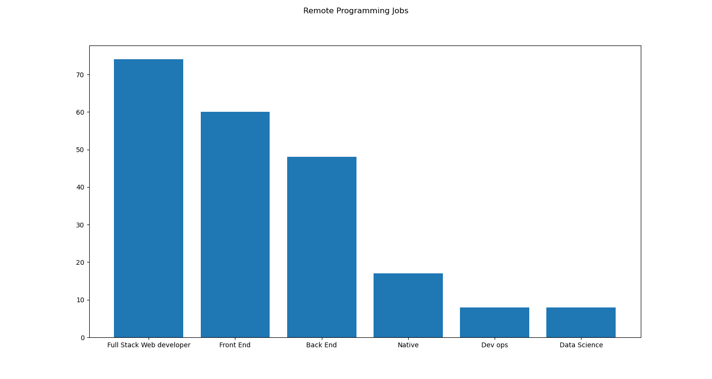
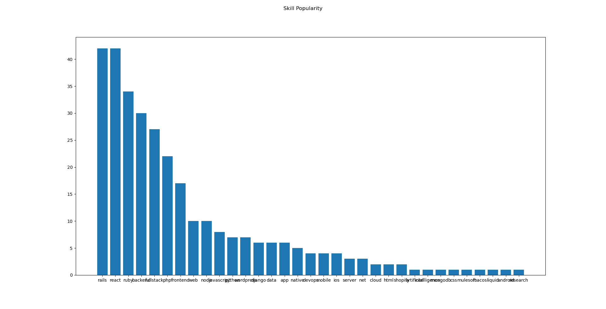

# Popular programming skill in 2020 for remote work

## Why I created this project
This project came about when I was deciding on which path of develop my programming knowledge. I would like to know what skills and roles are currently in demand for remote work
by the market in 2020. 

## How I develop this project
I scrape WeWorkRemotely to get the keywords for job openings using Puppeteer and Cheerio. The DOM file for the website is fairly clean and clear to handle. Not much nested HTML tags.

Thereaafter, I did a simple text cleaning by removing caps, spaces and dashes and transfer the data over to Python.

Based on research, I created a simple programming classification dictionary with types of programming roles as keys and populated the values with skills such as Python, React, Ruby, etc.

I felt there was no need to be using any complicated text classification NLP packages as there was not a lot of data to train on. Thereafter, I visualized the data with barchat from scikit learn.

## Reviewing results

Looking at the results for the most popular roles from WeWorkRemotely, it did not come as a surprise that a full stack role is in high demand. This also tells us that companies hiring from WeWorkRemotely are probably SMEs whom require a programmer to wear multiple hats during the development pipline, playing front end and back end roles.

I was surprise at the disproportionate lack in requirement for the DevOps role. I thought DevOps roles are gaining popularity as there is a need for someone to manage code base, code deployment, etc. Perhaps someoone can shed some light on this?

Ruby on rails and React are side by side as the most in demand skills in the market right now, with Ruby on rails having a slight edge when you count the additional tag count for 'Ruby'. It is not surprising that React is one of the most popular javascript framework right now. Having knowledge on these 2 skills will be crucial on obtaining a job in the remote work market in 2020.  
